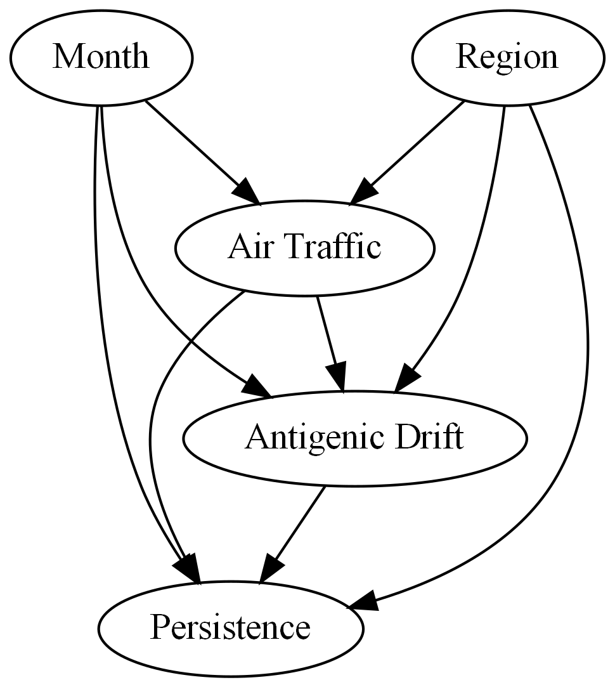
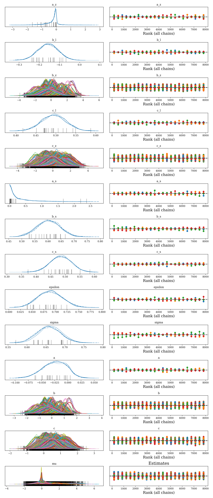
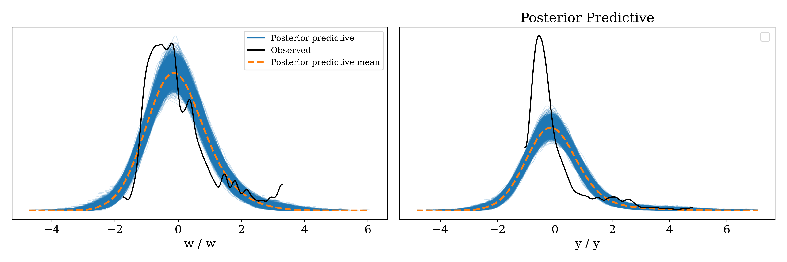
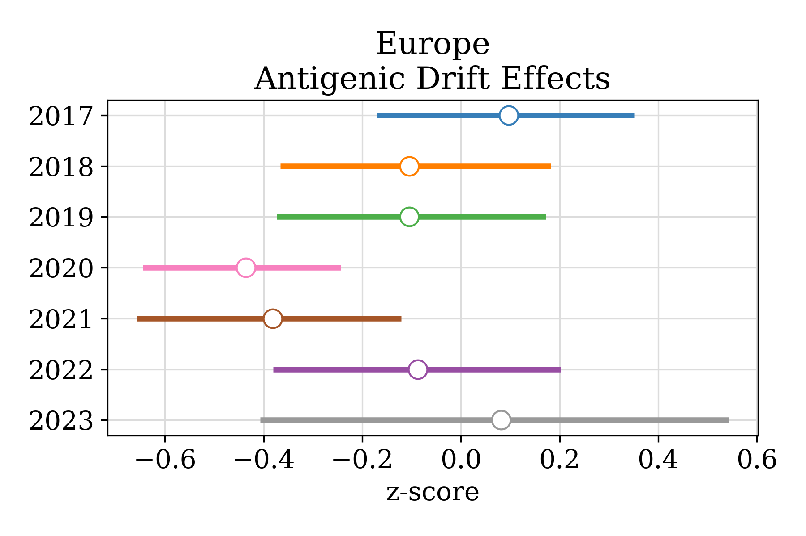
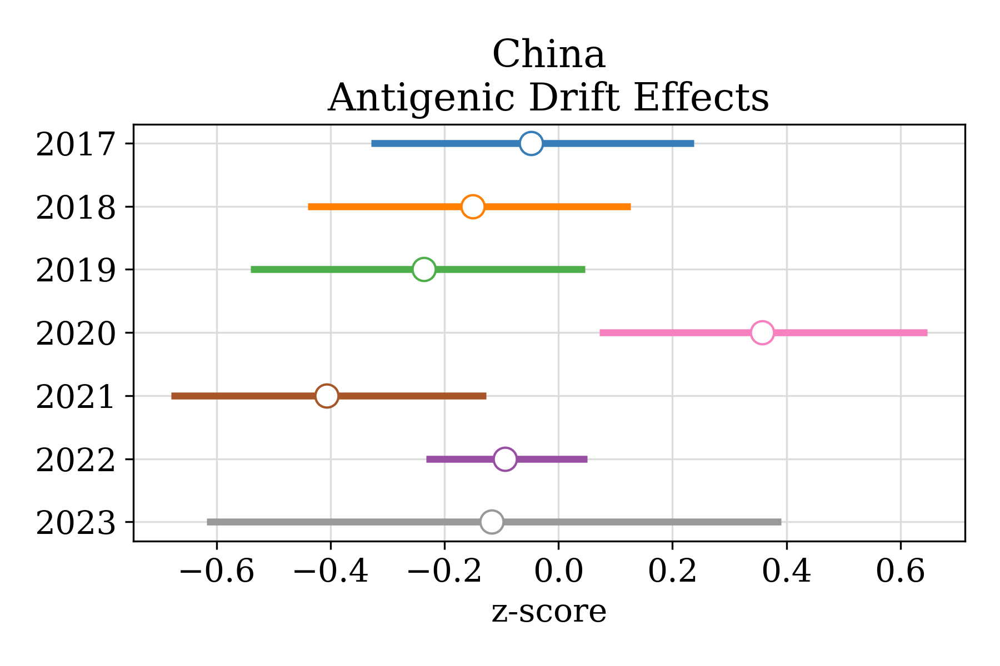
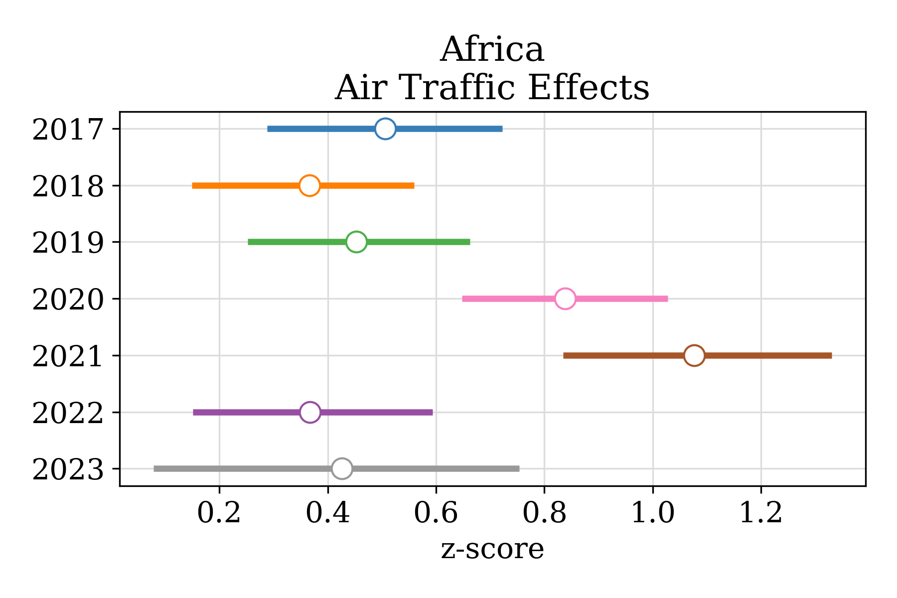
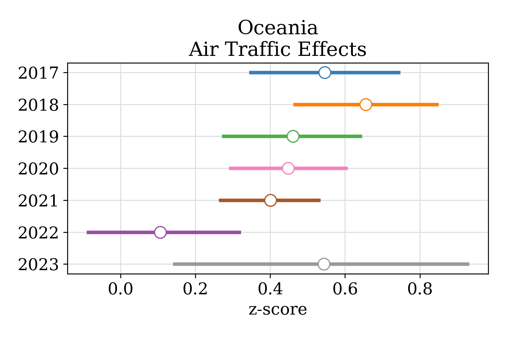
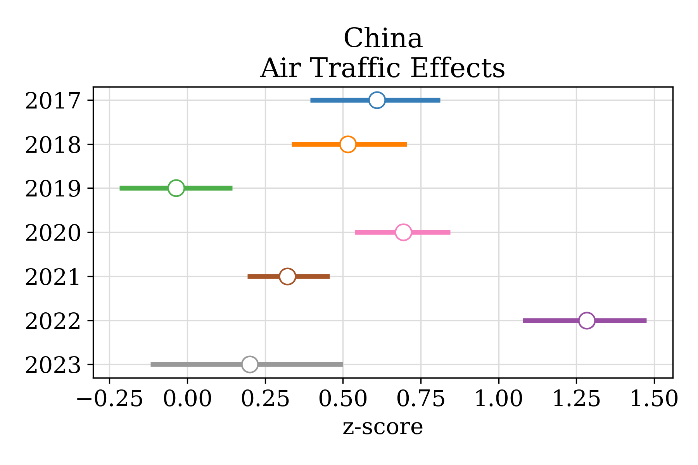

<h1> Persistence Regression Analysis </h1>

	Analysis below examines the relationship between antigenic drift, air traffic (defined as the converse of the total proportion of flight passenger arrivals), and influenza persistence in the context of pre, during and post pandemic periods (epochs) across eleven world regions.  

<h1> Model </h1>

 The directed acyclic graph (DAG) below indicates the pre-established relationships between relevant variables.

	

Where Antigenic is antigenic drift, and is the main exposure variable affecting persistence. Other variables represent conditioned variables. To estimate these effects, we built the following Bayesian model:  

 as, bs, cs ~ HalfNormal(1)  

 al, bl, cl ~ Normal(0, 1)  

 az, bz, cz ~ Normal(0, 1)  

 a = al + asaz  

 b = bl + bsbz [region,month] 

 c = cl + cscz [region,month] 

 &gamma;  = a + cx 

 &epsilon; ~ HalfNormal(1) 

 &#373; ~ Normal(&gamma;, &epsilon; ) [observed = w]

 &mu;  = a + bw + cx 

 &sigma; ~ HalfNormal(1) 

 &#375; ~ Gaussian(&mu;, &sigma;) [observed = y] 

Where <i>a</i> is an intercept, <i>b</i> and <i>c</i> are varying parameters of region by month size, and w, x and y are the standarised values of air traffic, antigenic-drift and persistence respectively.

<h1> Results </h1>

 The model was sampled using HMC NUTS with 2000 tuning steps, 2000 samples and 0.99 target-accept. The model sampled well with ESS > 1000, R-hats ~ 1 and BFMIs >= 0.75. However posterior predictive checks indicate predictive inefficiency. 

	

The model shows a reasonable fit based on posterior predictive checks.

	

Estimates of total effects seem to indicate that Africa strongly drives the association between air-traffic, antigenic-drift and persistence. See figures below, shadows in figures below indicate 90% highest density intervals (HDIs).

	

	

	

The direct effects of air-traffic and antigenic-drift are summarised in the forest_plots directory. Example plots for antigenic-drift in mostly-tropical regions below:

	
	

	
	

	

Note that during pandemic effects are strong for Africa, while other regions remain around zero, maybe with exception of China.

	
	

	
	

Effects of air-traffic are generally positive, with strong effects on Africa for 2020 and 2021 and on South Asia during 2021.

	
	

	
	

	

Effects remain moderate in other regions, maybe with exception of China, which shows slightly higher effects between 2020 and 2022.

	
	

	
	

<h1> Conclusion </h1>

 Present results indicate that Africa shows the strongest pandemic-related effects of antigenic-drift, while the effects of inter-regional air traffic remain relatively constant in most regions, with slight decreases in the pandemic period, Africa and South Asia show the opposite pattern.  

<H1> References </H1>
